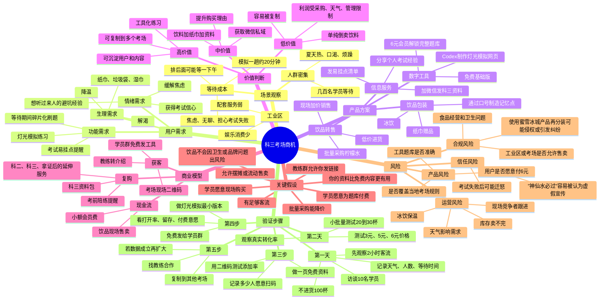

# 科三考场商机思维导图

## 严厉压力测试

你现在最大的进步是开始从“我会什么”转向“别人痛在哪里”。但你的想法里有几个危险假设，必须先打掉：

1. “几百人在场”等于“几百个客户”是错的。真正客户只包括口渴、没自带水、看见你、信任你、愿意马上掏钱的人。
2. “我想得到别人也想得到”不重要。商业不是比谁先想到，而是比谁验证更快、执行更稳、风险更低、复利更强。
3. 单纯卖水不是好生意，最多是一次性现金流。真正值得做的是把现场流量导入微信或工具，把一次交易变成用户资产。
4. “神仙水必过”这种噱头要谨慎。它有传播性，但也可能显得低信任、虚假承诺。更稳的表达是“考前稳心冰饮”“附科三易挂点清单”。
5. Codex不是赚钱机器，它只是生产工具。赚钱来自你发现具体人群的具体痛点，然后用更低成本、更快速度交付解决方案。

## 更清醒的版本

这个机会不应该被定义为“倒卖柠檬水”，而应该定义为：

> 在科三考场等待场景中，向高焦虑、低耐心、强结果导向的学员，提供降温、缓解焦虑、考前复习和避坑信息的一体化微服务。

第一步别做大。你要先拿数据：

- 2小时经过人数
- 主动询问人数
- 真实购买人数
- 每杯毛利
- 卖完时间
- 加微信比例
- 工具打开率
- 愿意付6元的人数

如果没有这些数字，你现在说的“商机”还只是兴奋感，不是商业判断。

